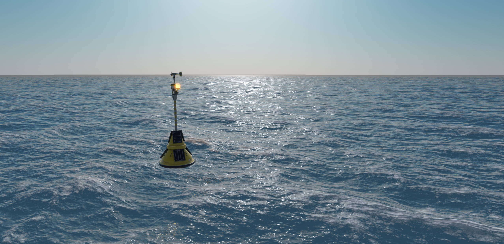
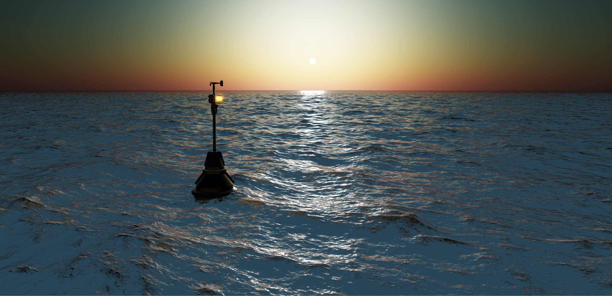
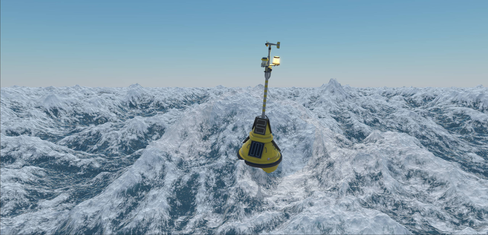
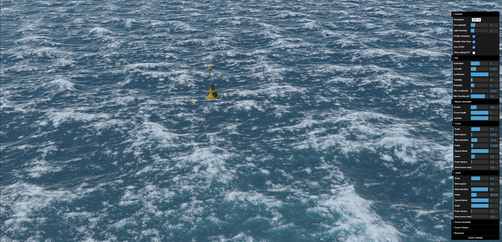

# Ocean demo in WebGPU

This is a port to [Babylon.js](https://www.babylonjs.com/) of the great project [FFT-Ocean](https://github.com/gasgiant/FFT-Ocean): all credits to Ivan Pensionerov (https://github.com/gasgiant)!

Link to the demo: https://popov72.github.io/OceanDemo/dist/index.html

You can also browse this demo in the Babylon.js Playground: https://playground.babylonjs.com/#YX6IB8#39

Use F8 to show/hide the GUI (after you click anywhere in the rendering area to give focus to the canvas) and WASD to move.

**Note that your browser needs to support WebGPU!**

# Running locally

To run the demo on your local computer

1. Clone / download this repository
1. run `npm install` to install the needed dependencies.
1. run `npm start`
1. A new window should open in your default browser. if it doesn't, open http://localhost:8080
